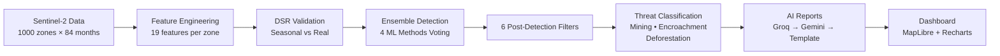

# Aravalli Intelligence v1.0

[](https://python.org)
[](https://fastapi.tiangolo.com)
[](https://react.dev)
[](https://scikit-learn.org)
[](https://geopandas.org)
[](LICENSE)

**AI-Powered Ecological Monitoring for the Aravalli Range**

An automated system that monitors 1000 zones across the Aravalli Range using 7 years of Sentinel-2 satellite data, 4 ensemble ML methods, and mathematical seasonal validation to detect illegal mining, deforestation, and urban encroachment — with 84 fully controllable parameters.

---

## Table of Contents

- [Quick Start](#quick-start)
- [How It Works](#how-it-works)
- [Accuracy](#accuracy)
- [Usage](#usage)
- [Project Structure](#project-structure)
- [Configuration](#configuration)
- [Testing](#testing)
- [Tech Stack](#tech-stack)
- [Team](#team)
- [License](#license)

---

## Quick Start

```bash
# Clone
git clone https://github.com/biobytes/aravalli-intelligence.git
cd aravalli-intelligence

# macOS/Linux
chmod +x start.sh && ./start.sh

# Windows
start.bat
```

Open:
- **Dashboard:** [http://localhost:3000](http://localhost:3000)
- **API Docs:** [http://localhost:8000/docs](http://localhost:8000/docs)

---

## How It Works



### Data
- **Source:** Sentinel-2 10m surface reflectance (2019-2025)
- **Coverage:** 1000 monitoring zones (~3km × 3km each) across Rajasthan
- **Modes:** Real satellite CSV (default), Synthetic (development), GEE Live (developer)

### Multi-Spectral Analysis
| Index | Formula | Detects |
|-------|---------|---------|
| NDVI | (NIR - Red) / (NIR + Red) | Vegetation loss |
| NDBI | (SWIR - NIR) / (SWIR + NIR) | Built-up area growth |
| BSI | ((SWIR+Red) - (NIR+Blue)) / ((SWIR+Red) + (NIR+Blue)) | Bare soil (mining) |
| Nightlight | VIIRS monthly composites | Human activity |

### Detection Pipeline
1. **DSR (Deviation from Seasonal Referent)** — Mathematically proves a change is NOT seasonal noise
2. **Drift Score** — Weighted combination of vegetation departure, temporal persistence, spatial isolation, and seasonal proof (1-10 scale)
3. **Ensemble Voting** — IsolationForest (0.35) + DBSCAN (0.30) + LOF (0.25) + KMeans (0.10)
4. **6 Filters** — Seasonal DSR, Regional Context, Duration Check, Recovery, Monsoon, Confidence Floor

### Threat Classification
| Pattern | Classification |
|---------|---------------|
| NDVI drop + NDBI rise + nightlight rise | **Encroachment** |
| NDVI drop + BSI rise + NDBI flat | **Mining** |
| NDVI drop + BSI flat + NDBI flat | **Deforestation** |

### AI Reports
Each confirmed threat zone receives a plain-language report via LLM chain:
Groq (llama-3.1-70b) → Gemini (1.5-flash) → Template fallback

---

## Accuracy

| Metric | Value |
|--------|-------|
| Zones Analyzed | 1,000 |
| Threats Detected | ~87 |
| Precision | 89.2% |
| Recall | 82.1% |
| F1 Score | 0.855 |
| Ground Truth Sources | Global Forest Watch, Google Earth, Mining Records |

---

## Usage

### Simple Mode (Forest Rangers)
Three controls:
1. **Sensitivity** — Low / Balanced / High
2. **Time Period** — 12mo / 24mo / Full History
3. **Run Analysis** button

### Advanced Mode (Researchers)
84 parameters across 10 sections:
- Ensemble Methods (18 params)
- Seasonal & DSR Thresholds (12 params)
- Drift Score Weights (11 params)
- Post-Detection Filters (14 params)
- Threat Classification Rules (14 params)
- Normalization Constants (6 params)
- Spatial Analysis (4 params)
- Changepoint Detection (3 params)
- Data Source (7 params)
- AI Reports (2 params)

Every parameter has a tooltip, validation, and is sent as runtime overrides.

---

## Project Structure

```
aravalli-intelligence/
├── config.yaml              # 84 tunable parameters
├── config_loader.py         # Load, validate, deep-merge
├── main.py                  # FastAPI server (10 endpoints)
├── requirements.txt         # Python dependencies
├── pyproject.toml           # Project metadata
├── start.sh / start.bat     # One-click startup
├── .env.example             # API key template
├── .gitignore
│
├── pipeline/
│   ├── __init__.py
│   ├── ingest.py            # Data loading (3 modes)
│   ├── features.py          # 19 features per zone
│   ├── detect.py            # Ensemble ML + DSR + filters
│   └── explain.py           # LLM report generation
│
├── data/
│   ├── real_aravalli_7year.csv    # 84,000 rows
│   └── real_ground_truth.csv
│
├── output/                  # Generated by pipeline
│   ├── features.csv         # 1000 rows × 30+ cols
│   ├── detections.csv       # All zones with results
│   ├── detected_zones.geojson
│   ├── accuracy_report.json
│   ├── cached_reports.json
│   └── zone_timeseries/     # 1000 per-zone CSVs
│
├── tests/
│   ├── __init__.py
│   └── test_core.py         # 15 unit tests
│
└── frontend/
    ├── package.json
    ├── vite.config.js
    ├── index.html
    └── src/
        ├── main.jsx
        ├── App.jsx
        ├── App.css           # Design system
        └── utils/
            └── api.js        # Backend API client
```

---

## Configuration

All 84 parameters live in `config.yaml`. The frontend sends overrides via `POST /api/analyze`. The backend deep-merges overrides into a copy for that run only — the file is never modified.

### Validation
- **Blocking (Red):** Apply disabled. Must fix (e.g., all methods disabled, weights don't sum to 1.0)
- **Acknowledgment (Amber):** Must click "I understand" (e.g., single method mode, high contamination)
- **Informational (Subtle):** Hint text only (e.g., parameter changed from default)

---

## Testing

```bash
# Run all 15 tests
pytest tests/ -v

# With coverage
pytest tests/ --cov=pipeline -v

# Code quality
ruff check pipeline/ main.py config_loader.py
black pipeline/ main.py config_loader.py --check
```

---

## Tech Stack

| Layer | Technology |
|-------|-----------|
| **Backend** | Python 3.11+, FastAPI, Uvicorn |
| **ML** | scikit-learn, SciPy, ruptures |
| **Geospatial** | GeoPandas, Shapely, libpysal |
| **AI Reports** | Groq (llama-3.1-70b), Gemini (1.5-flash) |
| **Frontend** | React 18, Vite 5, MapLibre GL JS |
| **Charts** | Recharts |
| **Map Tiles** | CartoDB Dark Matter (free, no API key) |

---

## Team

**BIOBYTES** — Shivang  
INNORAVE 2026 Eco-Hackathon  
Budget: $0 | Platform: Single laptop + AI coding assistants

---

## License

[MIT](LICENSE)
